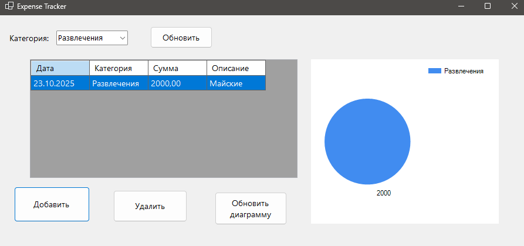

# Expense Tracker (WinForms)
---
- Приложение для учета расходов
---
- Expense accounting application
---

## Что в приложении?
- Добавление, удаление и фильтрация расходов
- Диаграмма по категориям
- Сохранение данных в json (можно добавить бдшку)

---

## What's in the app?
- Adding, deleting, and filtering expenses
- Chart by category
- Saving data in json (you can add a hash)

---
## Nuget Packages
- System.Windows.Forms.DataVisualization
---
## Приложение:

---